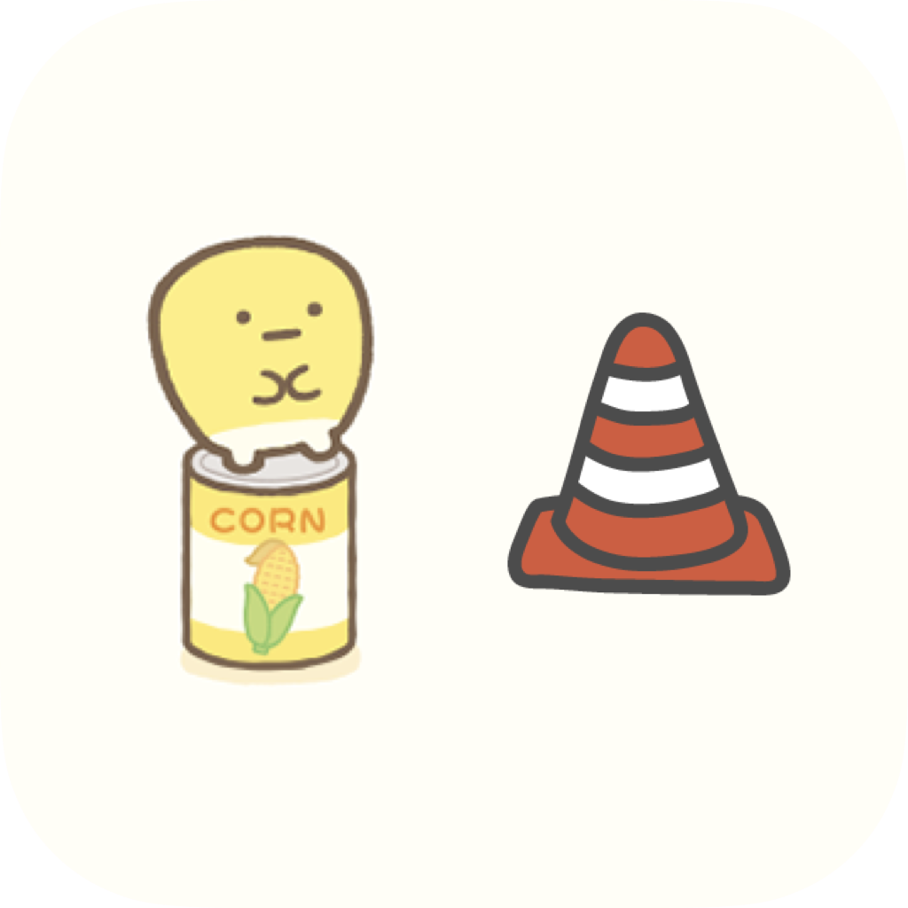
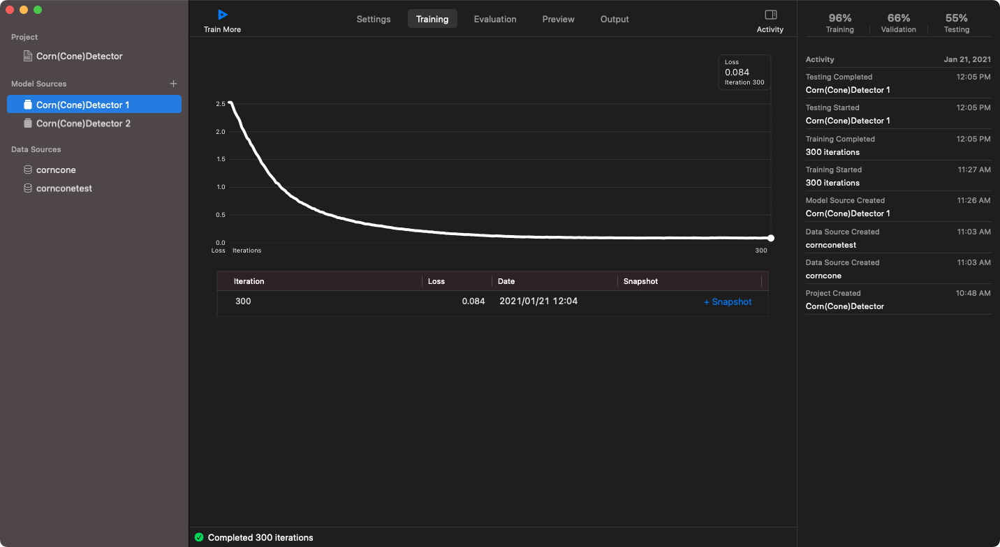

# CornConeDetector

  

This application can detect **corn** (sweet corn) or **cone** (road cones, traffic cones or pylons). The character on the left of the app icon is [すみっコぐらし (Sumikko Gurashi)'s こーん (corn)](https://www.san-x.co.jp/sumikko/campaign/hokahoka_soup/#character).

| | Corn | Cone |
|:-:|:-:|:-:|
||||

It is base on the live capture sample code provided by Apple: [Recognizing Objects in Live Capture](https://developer.apple.com/documentation/vision/recognizing_objects_in_live_capture).

## Requirements
- iOS 14.0+
- Xcode 12.0+

## Model training

The object detection model used in this app (**CornConeDetector.mlmodel**) was trained by **Create ML**'s Object Detection templete. Thanks to transfer learning, the model size is small (6.8 MB). The model uses Vision Feature Print, which is a feature extractor optimized for object detection.

### Parameters
- Algorithm: Transfer Learning
- Iterations: 300
- Batch Size: Auto

### Learning curve
