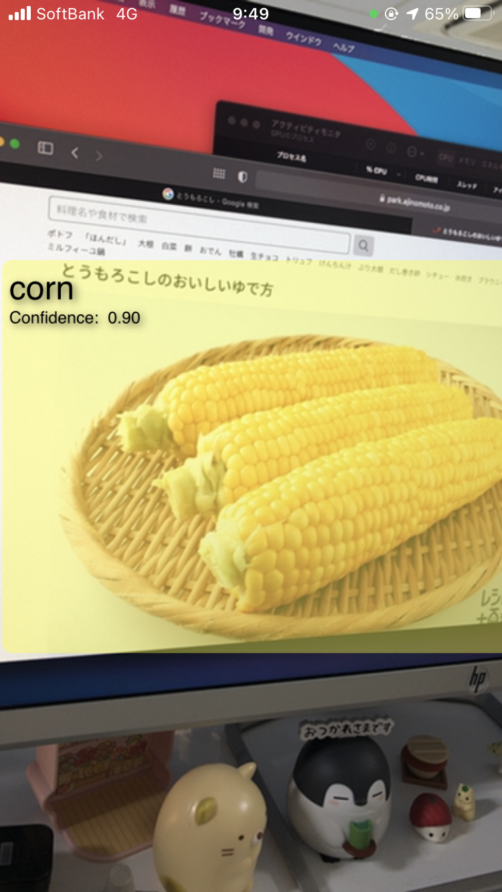
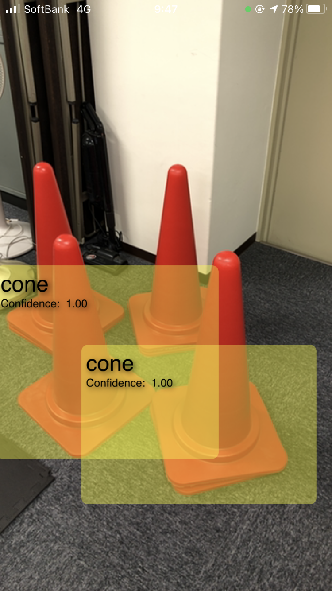

# CornConeDetector

  

This application can detect **corn** (sweet corn) or **cone** (road cones, traffic cones or pylons).

| | Corn | Cone |
|:-:|:-:|:-:|
||||

It is base on the live capture sample code provided by Apple: [Recognizing Objects in Live Capture](https://developer.apple.com/documentation/vision/recognizing_objects_in_live_capture).

## Requirements
- iOS 14.0+
- Xcode 12.0+

## Model training

The object detection model used in this app (CornConeDetector.mlmodel) was trained by **Create ML**'s Object Detection templete. Thanks to transfer learning, the model size is small. The model uses Vision Feature Print, which is a feature extractor optimized for object detection.
